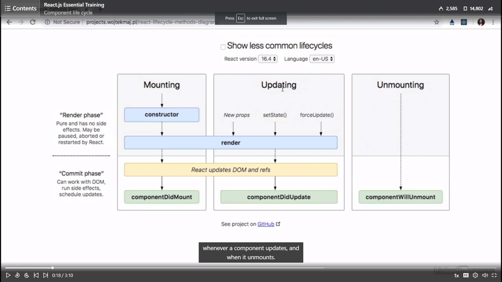

# React Lifecycle & Lifecycle Methods

#### `componentWillMount()`

This method is invoked before a component is mounted on the DOM. This happens once in the lifecycle of a component and before the first render.

**Common use case:**

Before rendering a component, you might want to get ready its props or state. For example, if a user logs in, you may request the server for user information that is to be displayed on the webpage. Hence, before mounting, you send a request to the server for the required information.

_However, the React documentation recommends using `constructor()` for any initialisations before the rendering and `componentDidMount()` for the above use case. According to them, componentWillMount\(\) is unsafe and should be avoided in new code._

\_\_

\_\_

#### `componentDidMount()`

This method is invoked when a component is mounted on the DOM.

**Common usecase:**

As this method is called once after the first render, you may want to initialize the state and props that will be required in the DOM. The server can be requested for information at this point.

#### `componentDidUpdate()`

This method is invoked when a component is updated.

**Common use case:** You can use this method to send requests to the server for any update in the state or props of the component that are required for DOM.

#### `componentWillUnmount()`

This method is called when the component is removed from the DOM.

**Common use case:**

It is generally used when you want to clear up things related to the component. For example, when a user logs outs of an application, you may want to clear their credentials and the other authorization tokens due to security purposes.

#### **`shouldComponentUpdate()`**

A method in React component which is overidden to prevent updating the components.

